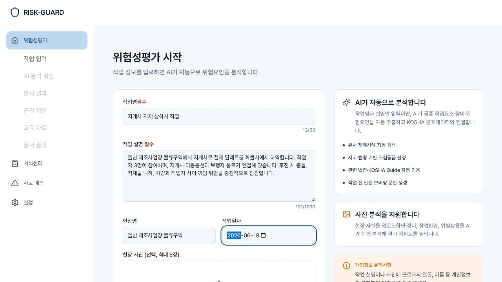
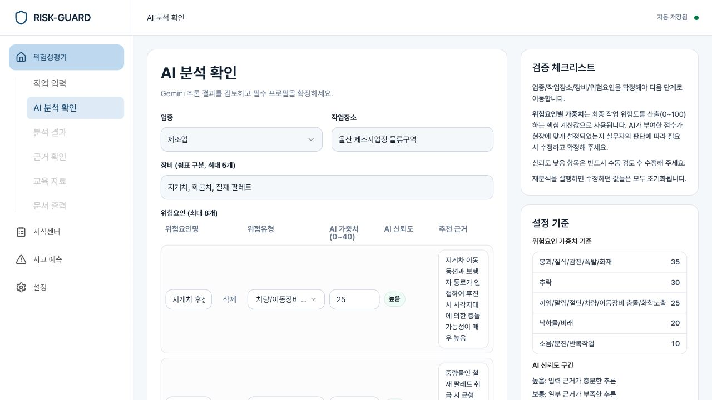
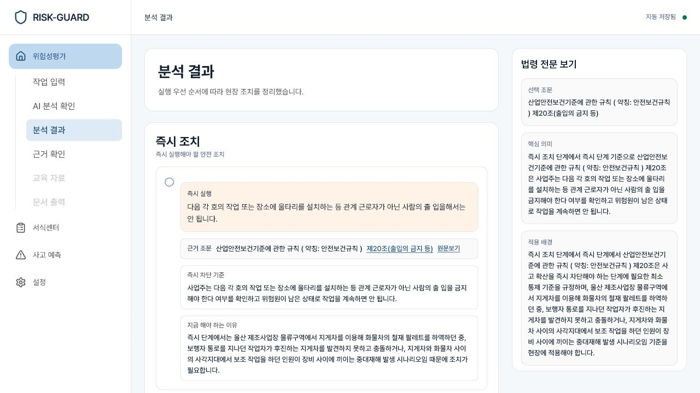
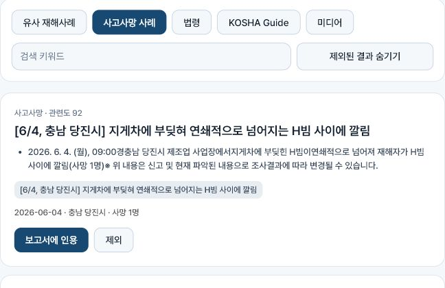
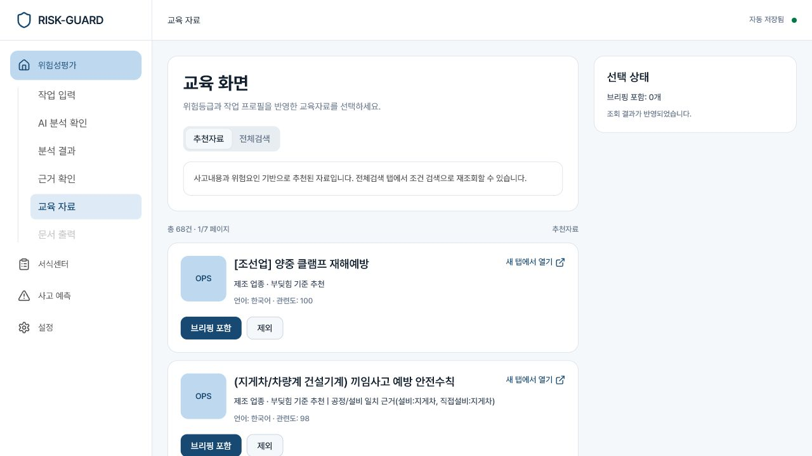
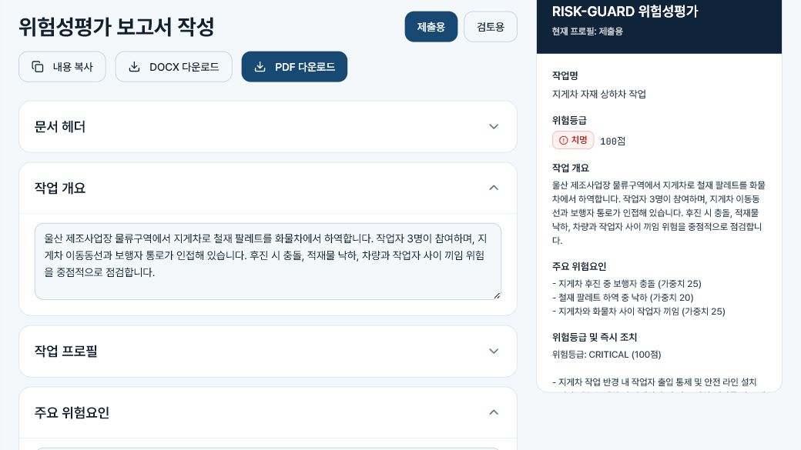

# 2026년 울산 공공데이터·AI 활용 창업경진대회 작성 예시

대상: `[서식 1] 참가 신청서`, `[서식 5] 제품 및 서비스 개발 부문`  
서비스: `RISK-GUARD`  
작성 기준일: `2026-06-18`

> 대괄호(`[ ]`) 부분은 실제 정보로 교체한다. 화면은 2026년 6월 18일 프로그램에서 `지게차 자재 상하차 작업`을 직접 분석해 캡처했다.

## 1. 참가 신청서 작성 예시

| 항목 | 작성 예시 |
| --- | --- |
| 응모분야 | `☑ 제품 및 서비스 개발` |
| 참여구분 | 타야잇시스템즈 명의 신청 시 `☑ 기업` |
| 팀명 | `타야잇시스템즈 RISK-GUARD팀` |
| 작품명 | `RISK-GUARD(리스크가드)` |
| 간략소개 | `KOSHA 공공데이터와 AI를 결합해 위험성평가서와 안전조치를 자동 작성하는 산업안전 웹 서비스` |
| 기획(개발)자 | `유창재` — 기존 문서 기준, 제출 전 확인 |
| 생년월일 | `1995. 06. 29.` — 기존 문서 기준, 제출 전 확인 |
| 주소·휴대폰·이메일 | `[실제 정보 입력]` |
| 소속 | `☑ 회사 / 타야잇시스템즈(TAYA IT SYSTEMS) / [부서 또는 대표]` |
| 공동개발 | 단독 출품이면 공란, 공동개발자가 있으면 전원 기재 |

## 2. `[서식 5]` 사업계획서 축약 예시

### 작품명

`RISK-GUARD(리스크가드)`

## 1-1. 개발 서비스의 기능 및 특징(우수성)

`RISK-GUARD`는 작업명, 작업 설명, 현장 사진을 AI로 분석해 위험요인과 작업 프로필을 만들고, 한국산업안전보건공단 공공데이터에서 유사 재해·사망사고·법령·교육자료를 찾는 웹 서비스다. 사용자는 AI 결과를 수정·확정한 뒤 위험성평가서, 체크리스트, 안전 브리핑을 DOCX 또는 PDF로 출력한다.

서비스는 `작업 입력 → AI 분석 확인 → 조치 분석 → 근거 선택 → 교육자료 선택 → 문서 출력`의 6단계로 구성된다. AI가 모든 판단을 확정하지 않으며, 사용자가 위험요인과 인용 근거를 검토하도록 설계했다.

기존 위험성평가 업무는 작업내용 정리, 재해사례 검색, 법령 확인, 교육자료 탐색, 문서 작성을 각각 수행해야 한다. 본 서비스는 이 과정을 하나의 작업 단위로 연결해 반복 검색과 전사 작업을 줄인다. 실제 예시에서는 `지게차 자재 상하차 작업`을 제조업으로 분류하고 지게차·화물차·철재 팔레트와 보행자 충돌·적재물 낙하·작업자 끼임 위험을 추출했다.

## 1-2. 공공·데이터의 활용 적정성(활용적정성)

공공데이터는 서비스의 핵심 근거로 사용한다.

| 공공데이터 | 활용 기능 |
| --- | --- |
| 국내재해사례 게시판 정보 조회서비스 | 유사 사고와 반복 위험패턴 탐색 |
| 사고사망 게시판 정보 조회서비스 | 중대사고 사례와 피해 규모 제시 |
| 안전보건법령 스마트검색 | 관련 법령·KOSHA Guide와 조치 근거 검색 |
| 안전보건자료 링크 서비스 | 업종·위험유형별 OPS·교안·영상 추천 |
| 공종·기계설비 파일데이터 | 작업명과 장비명 정규화, 검색어 보강 |

Gemini API는 작업 설명과 사진을 업종·장소·장비·위험요인으로 구조화하고, 공공데이터 검색 결과를 요약해 보고서 초안을 만든다. API별 성공·빈 결과·오류를 분리하고, 검증에 실패한 위험성평가 행은 `검토 필요`로 표시한다. AI 정확도 수치는 현재 확인되지 않았으므로 제출 전 별도 테스트 결과를 기재해야 한다.

데이터별 역할도 분리돼 있다. 재해사례는 반복 사고 패턴을 찾고, 사고사망 사례는 위험의 중대성을 알리며, 법령 스마트검색은 조치의 근거를 제시한다. 안전보건자료는 분석 이후 교육과 작업 전 브리핑에 사용한다. 특정 API가 실패해도 성공한 데이터는 계속 표시해 부분 장애가 전체 분석을 중단하지 않도록 구성했다.

제출 전에는 대표 작업 시나리오를 정해 `작업 프로필 추출 정확도`, `핵심 위험요인 재현율`, `법령 근거 적합률`, `평균 처리시간`을 측정한다. 산업안전 전문가의 정답표와 서비스 결과를 비교하고 실제 측정값만 사업계획서에 기재한다.

## 1-3. 기존 서비스와의 차별성 및 독창성(차별성)

| 구분 | 기존 방식 | RISK-GUARD |
| --- | --- | --- |
| 입력 | 전문 검색어를 직접 입력 | 작업 설명과 사진을 AI가 구조화 |
| 근거 | 여러 사이트에서 개별 검색 | 재해·사망사고·법령·교육자료 통합 |
| 결과 | 검색 후 문서를 수작업 작성 | 위험성평가서·체크리스트·브리핑 출력 |
| 검토 | 누락 여부를 직접 확인 | 사용자 확정, 근거 선택, 검토 상태 표시 |

차별점은 범용 AI 답변을 제공하는 데 그치지 않고, KOSHA 공공데이터의 원문 근거를 작업별 조치와 문서에 연결하는 것이다.

일반 검색 서비스는 사용자가 적절한 검색어와 법령명을 알아야 하며 결과를 다시 문서에 옮겨야 한다. 범용 생성형 AI는 빠르게 문장을 만들 수 있지만 근거의 최신성과 적합성을 별도로 검토해야 한다. `RISK-GUARD`는 AI를 입력 구조화와 요약에 사용하고, 공공데이터를 근거로 사용해 두 방식의 한계를 보완한다.

또한 사용자가 AI 분석 결과, 보고서 인용 사례, 교육자료를 직접 선택한다. 결과 생성 과정을 사용자 검토와 연결하므로 단순 자동작성보다 근거 추적과 수정이 쉽다.

## 2-1. 참가자(팀)의 개발 및 사업 역량(창업의지)

대표자는 제품 기획, UI 설계, React·TypeScript 개발, Supabase Edge Functions, KOSHA OpenAPI, Gemini API, DOCX·PDF 출력을 직접 구현했다. 현재 6단계 위험성평가, 서식센터, 사고예측, 회사정보 설정 기능이 포함된 시제품을 보유하고 있다.

| 역할 | 수행 내용 |
| --- | --- |
| 제품기획·UI | 현장 입력부터 보고서 출력까지 사용자 흐름과 화면 설계 |
| 프런트엔드 | React·TypeScript 기반 입력, 검토, 근거, 문서 화면 구현 |
| 데이터·AI | KOSHA OpenAPI, Gemini API, 검색어 생성과 결과 구조화 |
| 품질관리 | API 오류, 빈 결과, 모델 재시도, 위험행 검증과 출력 점검 |

공모전 이후에는 산업안전 전문가 검수와 현장 파일럿을 통해 기술 구현 중심의 시제품을 실제 업무에 적용 가능한 서비스로 전환한다. 참가자 이력은 아래 항목에 증빙 가능한 사실만 추가한다.

- 학력·전공: `[확실한 정보 없음]`
- 관련 경력·자격증·수상: `[확실한 정보 없음]`
- 산업안전 자문 또는 파일럿 협력처: `[확실한 정보 없음]`

## 2-2. 제품 및 서비스 개발 실적(개발 및 사업역량)

| 시기 | 개발 내용 |
| --- | --- |
| 2026. 4. | 6단계 사용자 흐름, AI 위험분석, KOSHA 데이터 연동 구현 |
| 2026. 4.~6. | 법령 조치, 서식 자동작성, 보고서 출력, 오류·검증 처리 보강 |
| 현재 | 실제 입력부터 AI 분석, 근거·교육자료 선택, 문서 출력까지 시연 가능 |

실제 시연에서는 작업 설명 입력 후 제조업 작업 프로필과 위험요인 3건을 생성했고, 사고사망 사례와 관련 교육자료 68건을 조회했다. 선택한 사고사례와 교육자료는 보고서와 안전 브리핑에 반영됐으며, 결과를 DOCX·PDF로 출력할 수 있는 상태를 확인했다.

다른 개발·납품·매출·특허 실적은 현재 자료에서 확인되지 않는다. 실제 증빙이 있을 때만 별도 표로 추가한다.

## 2-3. 보완·개선 및 확장 계획(확장계획 적절성)

| 단계 | 계획 |
| --- | --- |
| 제출 전 | 모바일 브라우저 대응, 공개 URL·QR, AI 성능 측정 |
| 2026년 하반기 | 산업안전 전문가 검수, 건설·제조·물류 파일럿, 업종별 템플릿 |
| 2027년 | 팀 협업·승인·이력, 다사업장 관리자, 기업 시스템 연동 |

현재 시제품은 데스크톱 중심이다. 공고의 모바일 시제품 조건을 충족하려면 모바일 대응을 구현하거나 데스크톱 웹 인정 여부를 주최 측에 확인해야 한다.

단기에는 휴대전화에서 작업 입력과 결과 확인이 가능하도록 화면을 조정하고, 심사위원이 접속할 수 있는 배포 URL·QR·테스트 계정을 준비한다. 중기에는 업종별 작업용어와 위험유형을 표준화하고 전문가 수정 결과를 평가자료로 축적한다. 장기에는 기업별 권한, 승인, 변경이력, 다사업장 통계를 추가해 조직 단위 서비스로 확장한다.

## 3-1. 개발된 제품 및 서비스를 활용한 창업(사업) 계획(사업성)

타야잇시스템즈는 `RISK-GUARD`를 중소 건설·제조·물류 사업장과 안전관리 대행기관을 위한 산업안전 SaaS로 사업화할 계획이다. 초기에는 현장 파일럿으로 위험요인·법령 적합성과 문서 작성시간을 측정하고, 이후 사업장별 템플릿·협업·이력관리 기능을 추가해 유료 구독으로 전환한다.

초기 고객은 안전 전담인력과 문서 작성시간이 부족한 중소사업장이다. 안전관리 대행기관에는 여러 고객사의 회사정보·서식·평가이력을 관리하는 기능을 제공하고, 중견기업에는 사업장별 권한과 승인 절차를 제공한다. `시제품 검증 → 현장 파일럿 → 유료 기능 검증 → 기업용 확장` 순서로 사업 위험을 줄인다.

파일럿에서는 기존 수작업 시간, 서비스 사용시간, 전문가 수정 건수, 근거 누락 건수, 재사용률을 측정한다. 기능 수보다 실제 시간 절감과 검토 품질을 사업화 판단 기준으로 사용한다.

## 3-2. 개발된 제품 및 서비스의 사업화 계획(사업화계획 우수성)

| 구분 | 실행안 |
| --- | --- |
| 제품 | 위험성평가 자동작성, 근거 연결, 서식센터, 교육자료, 문서 출력 |
| 가격 | 소규모 현장용 구독, 조직용 상위 구독, 기업 맞춤 구축 |
| 판매 | 웹 직접 가입, 기업 직접 영업, 안전관리기관 제휴 |
| 홍보 | 작업 시연 영상, 생성 문서 비교, 파일럿 사례 활용 |

수익은 월·연 구독료, 기업별 초기 구축·연동비, 안전관리 대행기관용 라이선스로 구성한다. 가격과 매출목표는 고객 인터뷰와 파일럿 결과를 근거로 확정한다.

초기 홍보는 작업 시나리오 시연 영상과 수작업·자동작성 결과 비교자료를 중심으로 진행한다. 이후 파일럿 성과와 전문가 검수표를 영업자료로 사용하고, 안전교육기관·컨설팅사와 제휴해 고객 접점을 확대한다.

사회적 효과는 중소사업장의 공공 안전정보 접근성을 높이고 반복 문서업무를 줄이는 데 있다. AI 결과의 출처와 사용자 선택을 기록해 책임 있는 검토를 지원하며, 전자문서 출력으로 종이 사용을 줄일 수 있다. 효과 수치는 실제 측정 전까지 임의로 제시하지 않는다.

## 3. 이미지 사용 순서

사업계획서가 길어지지 않도록 본문에는 `그림 1`, `그림 2`, `그림 4`, `그림 6`을 우선 사용한다. `그림 3`과 `그림 5`는 공간이 남을 때 추가한다.

## 4. 제출 전 확인

1. 모바일 실행 또는 데스크톱 웹 인정 여부
2. AI 정확도·처리시간 실측값
3. 배포 URL·QR·테스트 계정
4. 기존 사업화 아이템 또는 타 대회 수상작 해당 여부
5. 학력·경력·자격·수상 증빙
6. 제출 마감: `2026-06-26 18:00`
